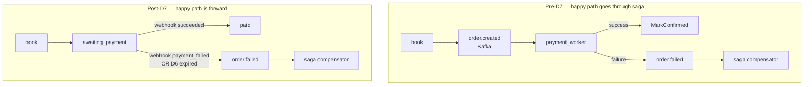
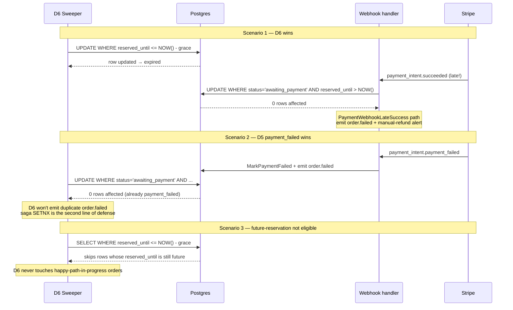

# Saga shouldn't manage the happy path — D7 narrowing as Garcia-Molina 1987 §5's 39-years-later implementation

> The race semantics of reservation → payment → expiry, and why removing the success path from the saga system is a return to the 1987 paper's original intent.

Fourth post in the series. The first three were about infrastructure-layer decisions (cache-truth, the Lua ceiling, the three-layer detector split); this one talks about a user-facing design — splitting the booking flow from "book = charge" into reservation → payment → expiry (Pattern A), and why D7 isn't "incidental cleanup" but rather restoring the saga to where it was supposed to be.

---

## Context

Before D1 the project had the legacy A4 path: `POST /book` came in, the worker persisted the order in PG, the outbox emitted `order.created`, the payment_worker consumed it from Kafka and called `gateway.Charge`, success ran `MarkConfirmed`, failure emitted `order.failed` and the saga compensator put the Redis inventory back.

What was wrong with this? **The flow put charge inside the saga system — treating the success path as if it were an event that needed compensation**. The mature shape used by Stripe Checkout, KKTIX, Eventbrite isn't this — they split charge into "server creates a PaymentIntent → client completes confirm with `client_secret` → server passively receives a webhook". Strong Customer Authentication (PSD2, mandatory 2019) makes charge inherently asynchronous; the server shouldn't be synchronously waiting on this flow.

We added Pattern A in D1-D6 [1]: reservation TTL, payment intent, webhook signature verification, expiry sweeper. D7 deleted the legacy A4 auto-charge path entirely — 800+ LOC, the saga compensator's set of triggers shrank from three sources to two (D5 webhook, D6 sweeper).

This post's central claim: **D7 isn't engineering hygiene (deletion-as-cleanup), it's a return to the design intent of Garcia-Molina & Salem's 1987 saga paper §5 — saga shouldn't manage the happy path** [6].

---

## Options Considered

| Option | Description | Why insufficient |
|---|---|---|
| **(1) Synchronous charge + retry** | `POST /book` calls the gateway directly, retry on failure | SCA-era client-side 3DS makes charge inherently async; server-side synchronous wait collapses on timeout/scale |
| **(2) Distributed transaction (2PC/XA)** | Postgres + Redis + Stripe all prepare → commit | 2PC blocks under failure + locks held across RTTs; Redis, Kafka, Stripe don't support XA. Industry largely abandoned this post-2010s [9] |
| **(3) Reservation TTL + intent + webhook + saga compensation** | book holds inventory + TTL, /pay creates intent, client confirms, webhook lands `paid`; expired by sweeper triggers saga compensation | **The choice** — aligns with Stripe Checkout / KKTIX industry consensus, and is the modern version of Garcia-Molina 1987 §1's airline reservation example |
| **(4) Optimistic async charge** | Return success to client first, charge in background, refund on failure | Better UX but inconsistency window is long, and still needs saga compensation — same topology as (3), only differing in client UX |

Choosing (3) isn't design innovation; it's alignment with 39 years of industry consensus.

---

## Decision

### The Pattern A saga structure literally is the 1987 paper

Garcia-Molina & Salem 1987 §1 [6] motivating example is the airline reservation:

> "consider an airline reservation application... transaction T wishes to make a number of reservations... after T reserves a seat on flight F1, it could immediately allow other transactions to reserve seats on the same flight"

Our KKTIX ticket-type model is the 39-years-later version of this — not a coincidence. Mapping §1's formal definition onto our implementation:

```
Saga = T₁(Reserve), T₂(Pay)
Compensating = C(Revert via revert.lua)

System guarantees one of:
  Either:  T₁, T₂                          (happy path)
  Or:      T₁, [Cancel-trigger], C         (failure path)
```

**Important caveat** (§1, original): "Compensating transaction undoes from a *semantic* point of view... does not necessarily return the database to the state that existed when the execution of Tᵢ began" — our `revert.lua` is `INCRBY +N`, not a restoration of the previous value. This is the "compensation ≠ rollback" distinction the 1987 paper drew explicitly.

§7 "Implementing Sagas on Top of an Existing DBMS" describes the "saga daemon (SD) scanning the saga table" — **almost exactly our outbox + saga_compensator design**: `events_outbox` = saga table, `OutboxRelay` + `SagaCompensator` = SD. The 1987 design lifted into a microservices + Kafka world.

The implementation spans multiple PRs: [#84 D1 schema](https://github.com/Leon180/booking_monitor/pull/84), [#85 D2 state machine](https://github.com/Leon180/booking_monitor/pull/85), [#86 D3 reservation 202](https://github.com/Leon180/booking_monitor/pull/86), [#87 D4 PaymentIntent](https://github.com/Leon180/booking_monitor/pull/87), [#92 D5 webhook](https://github.com/Leon180/booking_monitor/pull/92), [#94 D6 expiry sweeper](https://github.com/Leon180/booking_monitor/pull/94), [#98 D7 saga narrow](https://github.com/Leon180/booking_monitor/pull/98).

### Why D7 was inevitable: the §5 argument

In §5, while discussing the three recovery modes, the paper (p.254) leaves a conditional conclusion:

```
Condition 1: Save-point automatically taken before each Tᵢ
Condition 2: abort-saga commands prohibited (abort-transaction allowed)
Condition 3: Assume each Tᵢ will eventually succeed if retried enough times
       ↓
Conclusion: pure forward recovery is feasible, eliminating the need for
            compensating transactions entirely
```

**The happy path (book → pay → succeed) satisfies all three conditions**:
- Each Tᵢ has retry built in (worker PEL, Stripe webhook re-delivery)
- "Cancel the entire saga" isn't a possible event on the happy path — whether the customer continues isn't something the server can decide
- Each Tᵢ retried enough times will succeed (this is what idempotency-key + race-aware SQL guarantee)

**Conclusion**: the happy path doesn't need compensating transactions at all. Putting it in the saga system is an architectural mismatch.

D7 fixes that mismatch — the happy path moves to the forward path (webhook → MarkPaid), entirely bypassing the saga compensator. Saga scope narrows to the failure path only (D5 webhook payment_failed + D6 expiry + recon force-fail).

### Pre-D7 vs Post-D7



---

## Result

### Race semantics — three windows between D6 and the webhook

The D6 expiry sweeper and the D5 webhook are two independent processes racing on the same `awaiting_payment` row in the database. Three concrete race windows surface; each gets a different resolution:



The key design: **race-aware `MarkPaid` SQL** — `WHERE status='awaiting_payment' AND reserved_until > NOW()`. The webhook handler atomically asks "can I still advance this order?", and the SQL engine resolves the contest via row locks. Garcia-Molina §1 already warned that sagas have no isolation between each other: "other transactions might see the effects of a partial saga execution" — we don't fight it, we draw the race window directly into the SQL predicate [12].

D5 + D6's race-aware SQL plus the saga SETNX form two layers of defense. **At most one `order.failed` is emitted**, even if D6 and the webhook arrive in the same millisecond.

### Benchmark — no hot-path regression after D7

D7's worker UoW shrinks from `[INSERT order, INSERT events_outbox(order.created)]` to `[INSERT order]`. Numbers from [`docs/benchmarks/20260508_compare_c500_d7/`](../benchmarks/20260508_compare_c500_d7/):

- `accepted_bookings/s`: +0.01% (within noise floor)
- Booking p95: -8.7%
- HTTP p95: -9.7%

Removing the happy-path outbox write is net positive — two SQL statements become one. This is consistent with what Mockus et al. observed at Meta in 2025 [10]: code deletion is high-ROI engineering work, with SEV-causing diffs dropping from 76% to 24% (arXiv preprint, industrial-scale data but not yet peer-reviewed; flag accordingly when citing).

### Academic alignment

- **Local compensation > global saga** — Psarakis et al. CIDR '25 [7] finding: "Local compensations reduce rollback cost; global sagas preserve consistency but delay convergence." Our saga compensator runs in-process inside `app` (post-D7), which is exactly local compensation
- **Outbox is the practical solution for microservices** — Mohammad SLR 2025 [11]: "Exact-once delivery is unrealistic; transactional outbox + deduplication is the practical solution." Aligns with our outbox pattern from D1 onward
- **Formal guarantees** — Kløvedal et al. arXiv 2026 [12] (under OOPSLA review): the Accompanist runtime provides a formal framework proving saga atomicity under three assumptions (deterministic process, idempotent action, durable queue). Our three systems (Go runtime / Kafka / PG outbox) map cleanly to those three assumptions

---

## Lessons

### 1. The "saga as 1987 paper" frame should have come earlier

We took D1 → D7, seven PRs, to slowly converge on §5's forward-recovery argument. Had we adopted the design frame "**this is the engineering implementation of the 1987 paper**" from the start, D7 narrowing would have been visible during D1 design — the fact that the happy path doesn't belong in saga was already written down in §5.

Lesson: **read the seminal papers, not just vendor blogs**. Stripe / Temporal / AWS docs can teach you "how"; "why this way" often requires going back to the original 80s-90s research.

### 2. The §5 forward-recovery conditions aren't just "idempotent + retry"

Modern articles often simplify §5's three conditions down to "idempotency + retry". Reading the original showed the second condition is "**prohibit abort-saga**" — that's a design constraint, not a runtime property. Our happy path satisfies it because "the customer doesn't confirm" doesn't count as abort-saga; it's "the saga pauses at awaiting_payment for the next event". D6 expiry is the abort-saga event, and that's the path that runs backward recovery.

Once that distinction is clear, the boundary between saga scope and non-saga scope reveals itself.

### 3. Auto-charge is a representative case of legacy bias

The pre-D7 payment_worker design dates from before D1, from the "book = charge" assumption — true in the Stripe Charges API era (pre-2017), obsolete after PaymentIntent + SCA. **Designs left unaudited persist, even after their underlying assumptions have been invalidated**.

When D7 removed it, 800+ LOC went with one cut — and that LOC count itself quantifies the architectural debt: every line of legacy path is one more thing to test, instrument, and explain to readers. Romano's EASE '24 [8] "A Folklore Confirmation on the Removal of Dead Code" empirically validates this intuition — but the fact that even engineering folklore needed peer-reviewed proof in 2024 says something worth reflecting on.

### 4. Not doing D7 earlier isn't a regret; it's how learning works

In hindsight, could D7 have been done before v0.4.0? Technically yes; cognitively no. We needed D5's webhook in place and D6's expiry sweeper in place before "saga shouldn't manage the happy path" went from "an argument in a paper" to "an observable mismatch in our system".

This is what design evolution actually looks like — you have to build the wrong, old version before you can clearly see what's right.

---

## Up next

The D15 series originally planned 5 posts plus post-roadmap additions: cache-truth (done), Lua ceiling (done), detect-but-don't-fix (done), this post, plus a Docker-Mac NAT cap post (pending O3.2 variant B benchmark data).

The next post might cover v0.6.0 / D7 deletion as a standalone case study (if Mockus's data gets follow-up beyond OOPSLA, "how the engineering value of code deletion is quantified" deserves its own post), or implementation details of saga + outbox at microservice scale (Mohammad SLR's [11] 26 included studies are a good starting point).

Citation weight for portfolio posts: **peer-reviewed > vendor blog**, but industrial preprints (like Mockus Meta 2025) bring scale that small academic studies can't match — using both, with origin clearly flagged, lets the reader judge.

---

## References

| # | Source | Type |
|---|---|---|
| [1] | Stripe Docs, "Payment Intents." https://docs.stripe.com/payments/payment-intents | Industry docs |
| [2] | Stripe API Reference, "Idempotent Requests." https://docs.stripe.com/api/idempotent_requests | Industry docs |
| [6] | Garcia-Molina & Salem, "Sagas." *SIGMOD '87*, DOI: [10.1145/38713.38742](https://doi.org/10.1145/38713.38742) | peer-reviewed, seminal |
| [7] | Psarakis et al., "Transactional Cloud Applications Go with the (Data)Flow." *CIDR '25* | peer-reviewed |
| [8] | Romano et al., "A Folklore Confirmation on the Removal of Dead Code." *EASE '24*, DOI: [10.1145/3661167.3661188](https://doi.org/10.1145/3661167.3661188) | peer-reviewed |
| [9] | Laigner et al., "Data Management in Microservices." *PVLDB 14(13)* (2021) | peer-reviewed, seminal |
| [10] | Mockus et al., "Code Improvement Practices at Meta." [arXiv:2504.12517](https://arxiv.org/abs/2504.12517) (2025) | preprint, Meta authors |
| [11] | Mohammad, "Resilient Microservices: A Systematic Review of Recovery Patterns." [arXiv:2512.16959](https://arxiv.org/abs/2512.16959) (2025) | preprint, PRISMA SLR |
| [12] | Kløvedal et al., "Accompanist: A Runtime for Resilient Choreographic Programming." [arXiv:2603.20942](https://arxiv.org/abs/2603.20942) (2026) | preprint, under OOPSLA review |

Companion learning notes at [`docs/blog/notes/2026-05-pattern-a-foundations.zh-TW.md`](notes/2026-05-pattern-a-foundations.zh-TW.md) — full 12 sources, §A forward-recovery walkthrough, §B orchestration vs choreography, §C why distributed transactions were largely abandoned by industry. (zh-TW only for now; may translate later if companion-EN demand arises.)
