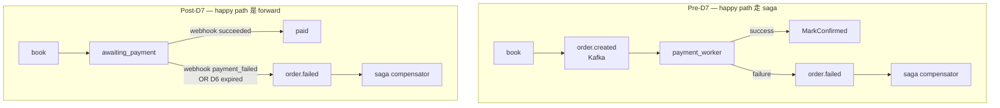
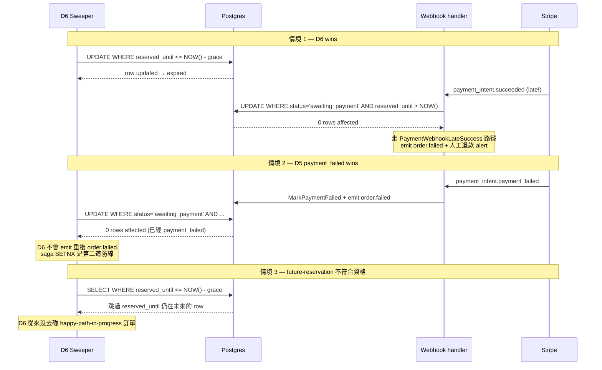

# Saga 不管 happy path — D7 narrowing 是 Garcia-Molina 1987 §5 的 39 年後實作

> 預訂 → 付款 → 過期的 race 語意,以及為什麼把成功路徑從 saga 系統移除是回到 1987 paper 的本意。

第四篇部落格。前三篇圍繞基礎設施層的決策(cache-truth、Lua 天花板、recon 三層分工);這篇談用戶看得到的設計 — 把訂票系統從「下單即扣款」拆成「預訂 → 付款 → 過期」的 Pattern A,以及 D7 為什麼不是「順便清理」,而是把 saga 範圍縮回它原本應該在的位置。

---

## Context

D1 之前,專案的訂票流程是 legacy A4 路徑:`POST /book` 進來,worker 在 PG 持久化訂單,outbox emit `order.created`,payment_worker 從 Kafka 消費並 `gateway.Charge`,成功就 `MarkConfirmed`、失敗 emit `order.failed` 由 saga compensator 還 Redis 庫存。

問題在哪?**這個流程把扣款放在 saga 系統裡 — 等於把成功路徑也當作需要補償的事件來處理**。Stripe Checkout、KKTIX、Eventbrite 的成熟做法不是這樣 — 它們把扣款拆成「server 端建 PaymentIntent → client 端用 `client_secret` 完成 confirm → server 端被動接 webhook」。Strong Customer Authentication(PSD2,2019 強制生效)讓扣款天然異步,server 端不該在這個 flow 上同步等。

我們在 D1-D6 把 Pattern A 補上[1]:reservation TTL、payment intent、webhook 簽章驗證、過期 sweeper。D7 把 legacy A4 自動扣款路徑整個刪掉 — 800+ LOC、saga compensator 的觸發來源從三個變兩個[D5 webhook、D6 sweeper]。

這篇的中心論點是:**D7 不是工程衛生(deletion-as-cleanup),是回到 Garcia-Molina & Salem 1987 saga paper §5 的設計本意 — saga 不該管成功路徑**[6]。

---

## Options Considered

| 選項 | 描述 | 為什麼不夠 |
|---|---|---|
| **(1) 同步扣款 + retry** | `POST /book` 直接呼叫 gateway,失敗就 retry | SCA 時代客戶端 3DS 驗證讓扣款天然異步;server 同步等 timeout/scale 都會崩 |
| **(2) Distributed transaction (2PC/XA)** | Postgres + Redis + Stripe 全部 prepare → commit | 2PC blocking + 鎖跨 RTT;Redis、Kafka、Stripe 都不支援 XA。業界 2010s 後幾乎放棄[9] |
| **(3) Reservation TTL + intent + webhook + saga 補償** | book 鎖庫存 + TTL,/pay 建 intent,client 端 confirm,webhook 回到 paid;TTL 過期由 sweeper 觸發 saga 補償 | **選這個** — 對齊 Stripe Checkout / KKTIX 業界共識,且本來就是 Garcia-Molina 1987 §1 airline reservation example 的現代版本 |
| **(4) Optimistic 異步扣款** | 先回 client 成功,背景扣款,失敗再退單 | 用戶感受好但資料不一致時間長,且仍需 saga 補償 — 跟 (3) 拓樸一樣,只差 client UX |

選 (3) 不是設計創新,是對齊行業 39 年累積的共識。

---

## Decision

### Pattern A 的 saga 結構就是 1987 paper

Garcia-Molina & Salem 1987 §1 [6] motivating example 直接是航空訂位:

> 「consider an airline reservation application... transaction T wishes to make a number of reservations... after T reserves a seat on flight F1, it could immediately allow other transactions to reserve seats on the same flight」

我們的 KKTIX 票種就是這個 39 年後的版本 — 不是巧合。把 §1 formal definition 套到我們的實作:

```
Saga = T₁(Reserve), T₂(Pay)
Compensating = C(Revert via revert.lua)

System guarantees one of:
  Either:  T₁, T₂                          (happy path)
  Or:      T₁, [Cancel-trigger], C         (failure path)
```

**重要警告**(§1 原文):「Compensating transaction undoes from a *semantic* point of view... does not necessarily return the database to the state that existed when the execution of Tᵢ began」 — 我們的 `revert.lua` 是 `INCRBY +N`,不是還原舊值。這是 1987 paper 就明確區分的「補償」≠「rollback」。

§7 「Implementing Sagas on Top of an Existing DBMS」描述的「saga daemon (SD) 掃 saga table」**幾乎就是我們的 outbox + saga_compensator 設計**:`events_outbox` = saga table,`OutboxRelay` + `SagaCompensator` = SD。把 1987 設計搬到 microservices + Kafka 之後的版本。

具體實作分布在多個 PR:[#84 D1 schema](https://github.com/Leon180/booking_monitor/pull/84)、[#85 D2 state machine](https://github.com/Leon180/booking_monitor/pull/85)、[#86 D3 reservation 回 202](https://github.com/Leon180/booking_monitor/pull/86)、[#87 D4 PaymentIntent](https://github.com/Leon180/booking_monitor/pull/87)、[#92 D5 webhook](https://github.com/Leon180/booking_monitor/pull/92)、[#94 D6 expiry sweeper](https://github.com/Leon180/booking_monitor/pull/94)、[#98 D7 saga narrow](https://github.com/Leon180/booking_monitor/pull/98)。

### D7 為什麼必然會發生:§5 末尾論點

§5 在講三種 recovery 模式時,paper p.254 末尾留了一個有條件的結論:

```
條件 1: 在每個 Tᵢ 開始前自動取 save-point
條件 2: 禁止 abort-saga 命令(允許 abort-transaction)
條件 3: 假設每個 Tᵢ 重試夠多次都會成功
       ↓
結論: pure forward recovery 可行,完全不需要 compensating transactions
```

**Happy path(book → pay → succeed)完全符合這三個條件**:
- 每段 Tᵢ 都自帶 retry(worker PEL、Stripe webhook re-delivery)
- 「整個 saga 取消」不是 happy path 的可能事件 — 客戶要不要繼續是客戶的事,不是 server 端可以決定的
- 每段 Tᵢ retry 夠多次都會成功(這是 idempotency-key + race-aware SQL 在保證的)

**結論**:happy path 根本不需要 compensating transaction。把它放在 saga 系統裡是 architectural mismatch。

D7 做的就是把這個 mismatch 修掉 — happy path 改走 webhook → MarkPaid 的 forward 路徑,完全不碰 saga compensator。saga 範圍縮窄到只剩失敗路徑(D5 webhook payment_failed + D6 expiry + recon force-fail)。

### Pre-D7 vs Post-D7



---

## Result

### Race semantics — D6 ↔ webhook 的三種 window

D6 過期 sweeper 跟 D5 webhook 是兩個獨立 process,在資料庫上對同一個 `awaiting_payment` 訂單競爭。實際分析下來有三種 race window,每種的解法不同:



關鍵設計:**race-aware `MarkPaid` SQL** — `WHERE status='awaiting_payment' AND reserved_until > NOW()`。WebHook 端原子地檢查「我可以推進這個訂單嗎?」,SQL 引擎用 row lock 把競賽收乾淨。Garcia-Molina §1 早就警告 saga 之間沒有 isolation:「other transactions might see the effects of a partial saga execution」 — 我們不對抗它,直接把 race window 在 SQL predicate 上劃出來[12]。

D5 + D6 的 race-aware SQL + saga SETNX 兩道保險疊起來,**最多 emit 一次 `order.failed`**,即便 D6 跟 webhook 在同一毫秒抵達。

### Benchmark — D7 後 hot path 沒退化

D7 的 worker UoW 從 `[INSERT order, INSERT events_outbox(order.created)]` 縮成 `[INSERT order]`。在 [`docs/benchmarks/20260508_compare_c500_d7/`](../benchmarks/20260508_compare_c500_d7/) 量到的數字:

- `accepted_bookings/s`: +0.01%(noise floor 內)
- 訂票 p95: -8.7%
- HTTP p95: -9.7%

刪除 happy path 的 outbox 寫入是淨正向 — 兩段 SQL 變一段。這跟 Mockus et al. 在 Meta 2025 [10] 的觀察一致:刪碼是 high-ROI engineering work,SEV-causing diff 從 76% 降到 24%(arXiv preprint,有 industrial-scale 數據但未經 peer review,引用時要標)。

### 學術對齊

- **Local compensation > global saga** — Psarakis et al. CIDR '25 [7] 的 finding:「Local compensations reduce rollback cost; global sagas preserve consistency but delay convergence」。我們的 saga compensator 跑在 `app` 行程內(D7 後),正是 local compensation
- **Outbox 是 microservices 的 practical solution** — Mohammad SLR 2025 [11]:「Exact-once delivery is unrealistic; transactional outbox + deduplication is the practical solution」。對齊我們 D1 起就在用的 outbox pattern
- **形式化保證** — Kløvedal et al. arXiv 2026 [12](under OOPSLA review)的 Accompanist 提供形式化框架,證明 saga atomicity 在 deterministic process / idempotent action / durable queue 三個假設下成立。我們的三個系統(Go runtime / Kafka / PG outbox)正好對應這三個假設

---

## Lessons

### 1. "Saga as 1987 paper" frame 應該更早採用

我們花了 D1 → D7 七個 PR 慢慢逼近 §5 forward recovery 的論點。如果一開始就把「**這是 1987 paper 的工程實作**」當作 design frame,D7 narrowing 在 D1 設計階段就會被預見 — happy path 不該走 saga 這件事,在 §5 就已經寫過了。

教訓:**讀 seminal paper,不要只看 vendor blog**。Stripe / Temporal / AWS 的文件可以教你「怎麼做」,但「為什麼這樣做」常常需要回到 80s-90s 的原始論文。

### 2. §5 forward recovery 條件不是「重試會成功」這麼簡單

§5 的三條件常被現代文章簡化成「冪等 + 重試」。實際讀原文發現第二條件是「**禁止 abort-saga**」 — 這是一個 design constraint,不是 runtime 屬性。我們的 happy path 之所以符合,是因為「客戶不確認」這件事**不算 abort-saga**,它是「saga 暫時停在 awaiting_payment 等下一個 event」。D6 過期才是 abort-saga 事件,而那條才走 backward recovery。

把這個區分搞清楚,saga 範圍跟非 saga 範圍的邊界自然顯現。

### 3. 自動扣款是 legacy bias 的代表

Pre-D7 的 payment_worker 設計來自 D1 之前的「下單即扣款」假設 — 那個假設在 Stripe Charges API 的時代成立(2017 之前),在 PaymentIntent + SCA 之後就過時了。**設計沒人重新審視就會留下,即便底層假設早已失效**。

D7 拿掉它的時候 800+ LOC 一刀刪 — 這個 LOC 數字本身就是 architectural debt 的量化:每多一行 legacy 路徑的程式,就多一條需要被測試、被 instrument、被人理解的路。Romano EASE '24 [8] 的 「A Folklore Confirmation on the Removal of Dead Code」直接驗證了這個直覺 — 但連工程 folklore 都需要 2024 才有 peer-reviewed 的實證,這件事本身值得反思。

### 4. 沒早做 D7 不是遺憾,是學習過程的本來面目

回頭看,D7 在 v0.4.0 之前可以做嗎?技術上可以;認知上不行。我們是在 D5 把 webhook 接好、D6 把過期 sweeper 接好之後,「saga 不該管 happy path」才從「論文上的論點」變成「我們系統裡可觀察到的 mismatch」。

設計演化的本來面目就是這樣 — 你需要把舊的、不對的版本實作出來,才能看清楚什麼是對的。

---

## 接下來

D15 系列原本規劃 5 篇 + post-roadmap 補齊:cache-truth(已寫)、Lua ceiling(已寫)、detect-but-don't-fix(已寫)、本篇、加 Docker Mac NAT cap(等 O3.2 變體 B 數據)。

下一篇可能寫 v0.6.0 / D7 deletion 作為單獨的 case study(若 Mockus 數據在 OOPSLA 之外有更新,值得專文討論「刪碼的工程價值如何被量化」),或寫 saga + outbox 在 microservices 規模下的實作細節(Mohammad SLR [11] 列出的 26 篇研究是好起點)。

學術引用對 portfolio post 的權重:**peer-reviewed 比 vendor blog 重**,但 industrial preprint(像 Mockus Meta 2025)在規模上比 academic 小研究更有說服力 — 兩者並用、明確標註出處,讀者會自己判斷。

---

## 引用

| # | 來源 | 類型 |
|---|---|---|
| [1] | Stripe Docs, "Payment Intents." https://docs.stripe.com/payments/payment-intents | 業界文件 |
| [2] | Stripe API Reference, "Idempotent Requests." https://docs.stripe.com/api/idempotent_requests | 業界文件 |
| [6] | Garcia-Molina & Salem, "Sagas." *SIGMOD '87*, DOI: [10.1145/38713.38742](https://doi.org/10.1145/38713.38742) | peer-reviewed,seminal |
| [7] | Psarakis et al., "Transactional Cloud Applications Go with the (Data)Flow." *CIDR '25* | peer-reviewed |
| [8] | Romano et al., "A Folklore Confirmation on the Removal of Dead Code." *EASE '24*, DOI: [10.1145/3661167.3661188](https://doi.org/10.1145/3661167.3661188) | peer-reviewed |
| [9] | Laigner et al., "Data Management in Microservices." *PVLDB 14(13)* (2021) | peer-reviewed,seminal |
| [10] | Mockus et al., "Code Improvement Practices at Meta." [arXiv:2504.12517](https://arxiv.org/abs/2504.12517) (2025) | preprint,Meta authors |
| [11] | Mohammad, "Resilient Microservices: A Systematic Review of Recovery Patterns." [arXiv:2512.16959](https://arxiv.org/abs/2512.16959) (2025) | preprint,PRISMA SLR |
| [12] | Kløvedal et al., "Accompanist: A Runtime for Resilient Choreographic Programming." [arXiv:2603.20942](https://arxiv.org/abs/2603.20942) (2026) | preprint,under OOPSLA review |

延伸學習筆記在 [`docs/blog/notes/2026-05-pattern-a-foundations.zh-TW.md`](notes/2026-05-pattern-a-foundations.zh-TW.md) — 完整 12 個來源、§A forward recovery 詳解、§B orchestration vs choreography、§C distributed transaction 為什麼業界放棄。
