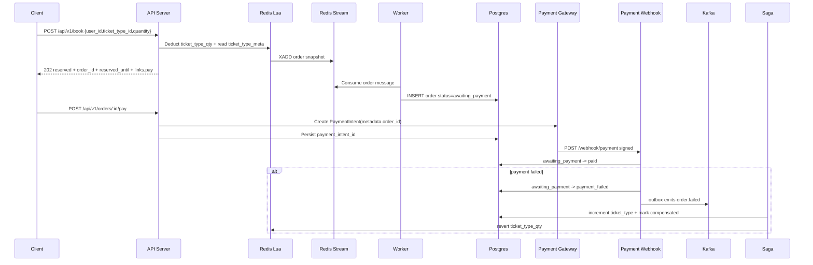
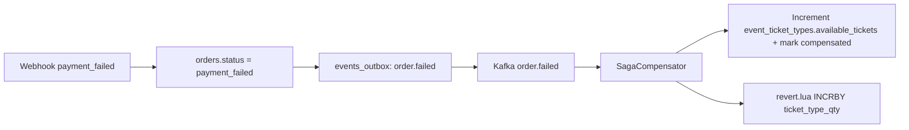

# Checkpoint Review: 2026-05-06 — D6 Preflight Flow + Observability Review

## Pre-check Snapshot

- **Trigger**: D6 preflight pause after D5 (`POST /webhook/payment`) merged.
- **Scope**: Targeted architecture/operations review, not a full 8-dimension checkpoint.
- **Baseline branch**: `main` at `2c328a4` (`feat(payment): D5 — POST /webhook/payment closes the Pattern A loop (#92)`).
- **PRs covered since the last checkpoint**: Phase 3 D1-D5 shape, especially #84-#92.
- **Reviewers dispatched**: none. This is a human/Codex synthesis checkpoint, based on the D3-D5 design review conversation and the current project documentation.

## Should This Be a PR?

Yes. For this project, a small documentation PR is the right shape.

Production teams commonly keep this kind of record as one of:

- an Architecture Decision Record (ADR),
- an operational readiness review,
- a phase checkpoint,
- or a pre-launch/pre-demo review note.

This document is closest to a **phase checkpoint**: it captures how the current flow works, what design choices solve which problems, what is already mature, and what D6 should close next. Keeping it under `docs/checkpoints/` makes it durable without overloading `README.md` or the canonical API spec.

## Current System Narrative

The system is now best described as:

> Redis absorbs flash-sale concurrency, PostgreSQL stores the durable facts, and asynchronous workers move orders through reservation, payment, and compensation while state-machine guards keep every retry safe.

### Entity Meaning

| Entity | Meaning | Current responsibility |
| :-- | :-- | :-- |
| `event` | The concert/event itself | Parent object and discovery surface |
| `event_ticket_types` | The sellable unit: section/tier/price/inventory, e.g. front row / middle / back row | Source-of-truth ticket-type inventory and immutable pricing fields |
| `order` | One customer reservation/payment attempt | Freezes `ticket_type_id`, `amount_cents`, `currency`, `reserved_until`, and payment status |

D4.1 moved the booking source of truth from event-level inventory to ticket-type inventory. That aligns the model with KKTIX/Stripe-style commerce: customers choose a specific sellable ticket type, not just an event.

## Main Flow After D5

The important product semantics are:

- `POST /api/v1/book` creates a **reservation**, not a paid order.
- `POST /api/v1/orders/:id/pay` creates a provider payment intent, but does not mark the order paid.
- `POST /webhook/payment` is the trusted money-moved signal.
- D6 will close the abandoned-reservation path: no confirm before `reserved_until` means expire + compensate.

## Design Choices And Problems Solved

| Problem | Design used | Why it works |
| :-- | :-- | :-- |
| Flash-sale contention | Redis Lua hot path | `DECRBY` + stream publish is atomic and fast |
| Sold-out overload | Redis-only 409 path | Rejections avoid Postgres entirely |
| Ticket-type lookup cost | Lua runtime metadata (`ticket_type_meta:{id}`) | Accepted booking path no longer does normal-path `TicketTypeRepository.GetByID` |
| API retries | Stripe-style `Idempotency-Key` + raw-body fingerprint | Same key/body replays; mismatched body returns 409 |
| Async DB persistence | 202 response + UUIDv7 `order_id` | Client sees a stable id before DB write finishes |
| Invalid state transitions | Domain state machine + SQL predicates | Rows move only through legal transitions |
| DB-to-Kafka dual write | Transactional outbox | Domain update and event write commit together |
| Payment failure rollback | Saga compensation | Failure event drives DB + Redis inventory restoration |
| Duplicate webhook delivery | DB terminal status idempotency | Provider redeliveries return 200 without reprocessing |
| Concurrent webhook race | `ErrInvalidTransition` -> re-read terminal status | Losing request maps to idempotent success if another request already completed |
| Late payment after TTL | Reservation-window predicate + late-success alert | Order does not become paid; operator gets refund-required signal |
| Stream/worker failures | Redis Streams PEL + DLQ | Transient errors retry; deterministic malformed messages go to DLQ |
| Silent broken sweepers | watchdog/recon metrics + panic counters | Monitoring detects loops that recover or go stale |

## Optimizations Already Landed

### Redis Runtime Metadata Hot Path

PR #91 superseded the PR #90 read-through cache by moving immutable booking metadata into Redis runtime keys:

| Key | Type | Meaning |
| :-- | :-- | :-- |
| `ticket_type_qty:{ticket_type_id}` | string integer | Live Redis inventory counter |
| `ticket_type_meta:{ticket_type_id}` | hash | `event_id`, `price_cents`, `currency` snapshot for Lua |

On the accepted path, `deduct.lua`:

1. decrements `ticket_type_qty:{id}`,
2. reads `ticket_type_meta:{id}`,
3. computes `amount_cents` with integer arithmetic,
4. publishes the full stream payload,
5. returns the reservation snapshot to Go.

This reduces Postgres pressure and keeps sold-out requests cheap. The key namespace split also prevents cache invalidation from deleting live inventory.

### Rehydrate And Repair

Runtime Redis state is treated as reconstructible:

- startup rehydrate rebuilds both metadata and quantity keys,
- metadata miss during booking reverts the decrement and retries one cold fill,
- compensation touches only quantity keys,
- direct DB edits invalidate only metadata keys.

This is a stage toward a cleaner future model where Postgres is the explicit source of truth and Redis is a projection rebuilt by rehydrate or CDC/WAL sync.

### Benchmark Discipline

Hot-path PRs now require apples-to-apples benchmark evidence:

- `scripts/k6_comparison.js`,
- 500 VUs,
- 60s,
- large ticket pool to avoid measuring mostly sold-out fast path,
- comparison report under `docs/benchmarks/`,
- explicit ticket conservation checks when inventory logic changes.

## Complex Business Scenarios

### Normal Success

1. Redis reserves inventory.
2. Worker persists `awaiting_payment`.
3. Client calls `/pay`.
4. Provider emits `payment_intent.succeeded`.
5. Webhook marks the order `paid`.

### Payment Failed

1. Provider emits `payment_intent.payment_failed`.
2. Webhook marks `payment_failed`.
3. Same transaction emits `order.failed` through outbox.
4. Saga compensator increments DB ticket inventory and Redis ticket inventory.
5. Order becomes `compensated`.

### Customer Never Confirms

Current state: partially open until D6.

D6 target:

1. Sweeper finds `awaiting_payment` orders with `reserved_until < now()`.
2. It marks them `expired`.
3. It emits `order.failed`.
4. Saga restores DB + Redis inventory.

This turns abandoned reservations into an active, observable rollback path.

### Payment Succeeds After Expiry

D5 already guards this:

- if the order is still `awaiting_payment` but `reserved_until` has elapsed, `MarkPaid` refuses the transition;
- the handler moves the order through the expired/failure path and emits the late-success metric;
- if D6 or saga already moved the row to `expired`/`compensated`, D5 emits `late_success{detected_at="post_terminal"}` and avoids duplicate transitions;
- humans must refund the provider-side charge until an automated refund job exists.

The key rule is: **do not mark paid after the reservation contract died**.

## Infrastructure Interactions

| Boundary | Interaction | Consistency strategy |
| :-- | :-- | :-- |
| API -> Redis | Lua deduct + stream publish | Atomic Redis script |
| Redis Stream -> Worker | XREADGROUP / PEL retry | At-least-once with deterministic DLQ |
| Worker -> Postgres | `domain.NewReservation` + insert | UUIDv7 order id minted at API boundary |
| Postgres -> Kafka | transactional outbox | Event and state commit together |
| Kafka -> Saga | `order.failed` consumer | Idempotent status guards |
| Saga -> Redis | `revert.lua` | `saga:reverted:{order_id}` idempotency key |
| Client -> Payment gateway | `/pay` creates PaymentIntent | Gateway idempotency on `order_id` |
| Gateway -> Webhook | signed provider event | HMAC verification + terminal-status idempotency |

The architecture intentionally accepts at-least-once delivery. Correctness comes from idempotent transitions, stable ids, and compensating actions rather than distributed transactions.

## Final Consistency Model

The project does not try to make Redis, Postgres, and Kafka commit atomically. Instead it uses a recoverable consistency model:

1. **Redis is the front gate** for inventory pressure.
2. **Postgres is the durable fact store** for orders, ticket types, and status transitions.
3. **Outbox bridges Postgres to Kafka** without dual-write loss.
4. **Saga compensates failures** in DB and Redis.
5. **Watchdogs and drift detectors observe stuck states** and re-drive or alert.

For payment failure rollback:

Idempotency points:

- webhook duplicate: terminal order status,
- outbox relay: unprocessed rows and retryable publish,
- saga DB path: compensated status guard,
- saga Redis path: `saga:reverted:{order_id}`,
- stream worker: stable `order_id` and DLQ classification.

## Webhook Impact On Testing

D5 made the payment flow more realistic and more testable, but it changes what "success" means in tests.

Before D5, a mock payment path could be tempted to mark success immediately after `/pay`. D5 deliberately avoids that. `/pay` creates the payment intent only. A signed webhook is required to mark paid.

That matters for D6:

- To test success, use the test-only confirm endpoint to emit a signed webhook.
- To test expiry, call `/pay` but do **not** confirm.
- To test failure rollback, confirm with `outcome=failed` and wait for saga compensation.
- To test late success, let the reservation expire first, then emit a succeeded webhook and verify refund-required signal.

Current test surface:

- unit tests for webhook verifier/handler/service,
- Postgres integration tests for repository predicates and migrations,
- test-only payment confirm endpoint for dev/demo,
- manual smoke scripts for full-stack behavior.

Recommended next step after D6: a full-stack integration harness that starts API, Redis, Postgres, Kafka, worker, outbox relay, saga, and sweeper together, then verifies the whole journey automatically.

## Observability Assessment

Current state: **strong for a portfolio project, credible as an early production baseline**.

### Strengths

| Area | Coverage |
| :-- | :-- |
| Health probes | `/livez` and `/readyz` distinguish process health from dependency readiness |
| Metrics | HTTP, booking, worker, Redis Streams, DLQ, outbox, recon, saga, inventory drift, webhook |
| Alerts | Broad Prometheus alert set with runbook URLs |
| Runbooks | Concrete operator actions for stream lag, DLQ, outbox, saga, drift, webhook incidents |
| Dashboards | Grafana dashboards are provisioned with the stack |
| Tracing | OTEL + Jaeger are wired |
| Logs | Structured logs with typed fields, `correlation_id`, and trace/span ids |
| Consistency visibility | Inventory drift detector, outbox pending collector, stream lag, watchdog outcomes |

The strongest maturity signal is that monitoring covers **business consistency**, not only process uptime.

### Remaining Gaps

| Gap | Why it matters | Suggested timing |
| :-- | :-- | :-- |
| No centralized log stack | Runbooks mention Loki-style queries, but local stack still relies mostly on `docker logs` | After D6 or before external demo polish |
| No full-stack synthetic canary | Unit/PG tests do not prove the whole booking/payment/saga pipeline is wired | After D6 |
| No SLO/burn-rate layer | Alerts are component-oriented, not user-journey/error-budget oriented | After D6/D7 |
| Async trace propagation is partial | `order_id` works, but stream/Kafka boundaries are not full distributed trace continuations | Nice-to-have |
| D5 late-success docs drift | Runtime has `detected_at="post_terminal"`; some docs still list only `service_check`/`sql_predicate` | Small docs cleanup |

## D6 Observability Requirements

D6 should not ship as just a sweeper. It should ship as an observable lifecycle component.

Recommended metrics:

| Metric | Meaning |
| :-- | :-- |
| `reservation_expiry_sweeps_total{outcome}` | Sweep result counts |
| `reservation_expired_orders_total` | Orders expired by D6 |
| `reservation_expiry_errors_total{stage}` | Query, transition, outbox, or compensation trigger failures |
| `reservation_expiry_duration_seconds` | Sweep latency |
| `reservation_expired_age_seconds` | How late expired orders were when swept |
| `reservation_expiry_backlog` | Current count of `awaiting_payment` rows past `reserved_until` |

Recommended alerts:

| Alert | Why |
| :-- | :-- |
| `ExpiredReservationBacklog` | Sweeper is not keeping up or is down |
| `ReservationExpiryErrors` | D6 is trying but failing |
| `ReservationExpiryCollectorDown` | Monitoring for the backlog is blind |
| `ReservationExpiryTooLate` | Expiry is consistently far behind the reservation window |

Runbook questions:

- Is the sweeper running?
- Is DB transition failing?
- Is outbox emit failing?
- Are expired orders stuck before saga compensation?
- Did a late-success webhook arrive after expiry and require refund?

## Industry Alignment, 2024-2026

This architecture is aligned with common 2024-2026 production patterns for reservation/payment systems:

- **Provider webhooks are the trusted payment completion signal.** Stripe recommends webhooks because client redirects and polling are less reliable for asynchronous payment methods and browser-abandon scenarios.
- **Webhook handlers must be idempotent.** Providers deliver at least once and may retry for days; terminal DB status is a valid idempotency anchor.
- **Webhook signing is mandatory.** HMAC verification over the raw request body is the standard trust boundary.
- **Reservation systems need expiry.** Limited inventory should be released when the customer does not complete payment within the hold window.
- **Transactional outbox and saga compensation are standard ways to avoid distributed transactions.** They trade atomic global commit for local transactions, durable events, retries, and compensating actions.

Useful external references checked during this review:

- Stripe PaymentIntent status and webhook guidance: <https://docs.stripe.com/payments/payment-intents/verifying-status>
- Stripe webhook best practices and retry behavior: <https://docs.stripe.com/webhooks>
- Stripe limited inventory / expiring sessions guidance: <https://docs.stripe.com/payments/checkout/managing-limited-inventory>
- AWS transactional outbox pattern: <https://docs.aws.amazon.com/prescriptive-guidance/latest/cloud-design-patterns/transactional-outbox.html>
- AWS saga pattern: <https://docs.aws.amazon.com/prescriptive-guidance/latest/cloud-design-patterns/saga.html>

## Gaps Versus Mature Production Systems

| Gap | Production expectation | Roadmap alignment |
| :-- | :-- | :-- |
| Abandoned reservations not fully closed yet | Active expiry sweeper | D6 |
| Manual refund for late success | Durable refund workflow or provider refund API integration | Post-D6/D7 |
| Single webhook secret | Current/next secret rotation window | Follow-up before real Stripe |
| No webhook inbox table | Durable event audit, event-id dedupe, replay tooling | Follow-up before production |
| No full-stack harness | Automated end-to-end pipeline verification | Strong candidate after D6 |
| Redis projection maintained by app flows | CDC/WAL or explicit projection rebuild strategy | Later cache-truth roadmap |
| Component alerts before journey SLOs | SLOs and burn-rate alerts | After D6/D7 stabilizes lifecycle |

## Recommended Next Steps

| Priority | Item | Target |
| :-- | :-- | :-- |
| P1 | Build D6 expiry sweeper with metrics, alerts, and runbook | D6 |
| P1 | Add D6 smoke path: book -> pay -> no confirm -> expire -> compensate | D6 |
| P1 | Update late-success docs for `detected_at="post_terminal"` | Small docs cleanup |
| P2 | Add full-stack integration harness for booking/payment/saga/expiry | After D6 |
| P2 | Add dual webhook secret rotation support | Before real Stripe |
| P2 | Add webhook inbox/refund task design | Before production-like payment demo |
| P3 | Add SLO/burn-rate dashboards for booking journey | After lifecycle stabilizes |
| P3 | Evaluate Loki/Promtail or another centralized log path | Demo polish / ops maturity |

## Outcome

This checkpoint records that the project is in a good position to start D6.

The architecture already has the right primitives: Redis hot path, Postgres state machine, transactional outbox, saga compensation, webhook idempotency, and broad observability. D6 should not change the foundation; it should complete the abandoned-reservation lifecycle and make expiry observable enough to demo and operate.
