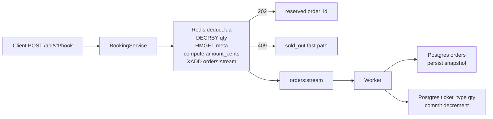
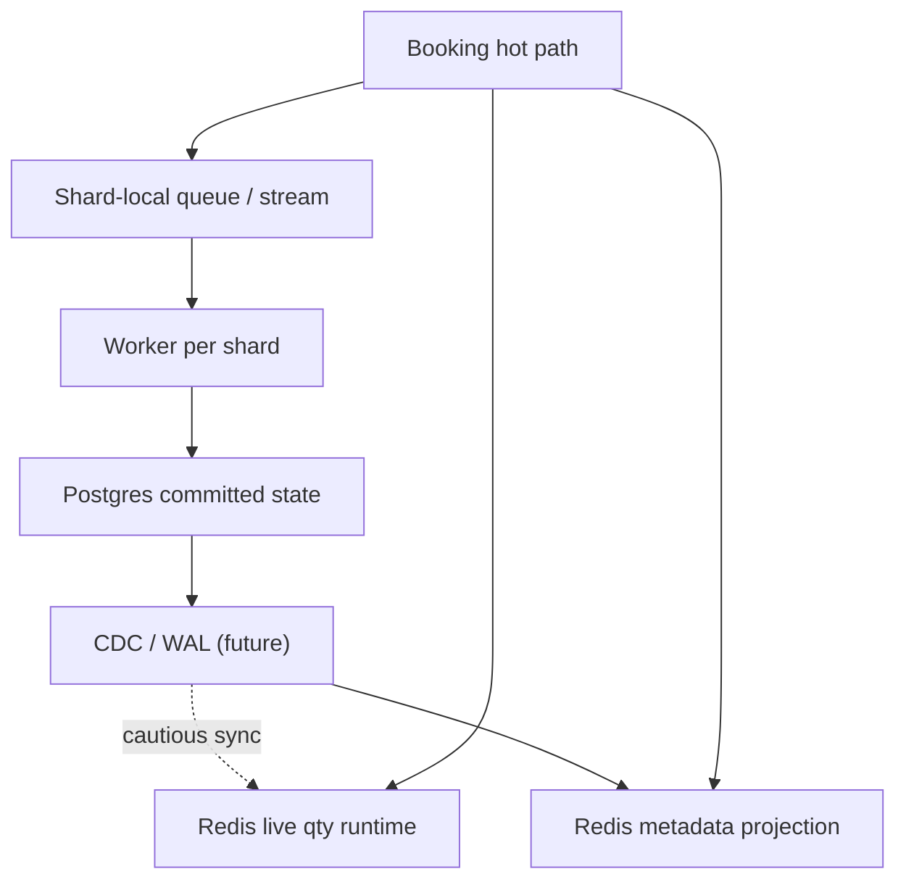

# Redis Runtime Metadata and Horizontal Scaling Notes

> 中文版本: [redis_runtime_metadata_scaling.zh-TW.md](redis_runtime_metadata_scaling.zh-TW.md)

## Status

This note captures the **active follow-up design** after PR #90. It records the planned direction that would move the immutable ticket-type snapshot into Redis runtime metadata consumed directly by `deduct.lua`, plus the team's current position on:

- why `amount_cents` is frozen during booking rather than payment,
- when a longer Redis Lua script is acceptable,
- when Redis Functions are worth adopting,
- and what actually blocks horizontal scaling in the current topology.

Until that follow-up merges, treat this as the canonical planning note for the booking hot path rather than as a statement of the current `main` implementation.

## Domain model

- `event` = the concert / show / activity itself.
- `ticket_type` = the sellable SKU the customer actually buys.
- If two options have different price, inventory pool, sale window, or purchase rules, model them as different `ticket_type` rows.
- If a label is only presentational, it can stay as `area_label` instead of becoming a distinct inventory pool.

This distinction matters because the booking hot path is ticket-type-centric: the user books a `ticket_type_id`, and the system derives `event_id` plus the frozen price snapshot from that choice.

## Why `amount_cents` is frozen during booking

`amount_cents` is not just a multiplication result. It is part of the reservation snapshot.

The booking path freezes `amount_cents` and `currency` at reservation time because:

1. the customer should pay the price they were quoted when the reservation was created,
2. the payment step should charge a frozen order fact rather than re-read mutable ticket-type state,
3. the async worker and downstream payment flow should receive a complete reservation intent,
4. direct price edits during the checkout window must not silently re-price an already reserved order.

In other words: the multiplication happens during booking because **pricing is part of order creation**, not because Lua happens to be a convenient place to do math.

## Planned runtime-metadata shape

The follow-up design replaces the normal-path `TicketTypeRepository.GetByID` lookup with two Redis runtime keys per ticket type:

- `ticket_type_meta:<ticket_type_id>` — immutable booking snapshot fields:
  - `event_id`
  - `price_cents`
  - `currency`
- `ticket_type_qty:<ticket_type_id>` — mutable live inventory counter

Planned flow:

Operational rules for this design:

- sold-out requests should return from Redis without a Postgres lookup,
- metadata misses should revert the decrement before returning a repair code,
- the Go caller may do one cold-fill of metadata and retry once,
- rehydrate must rebuild both metadata and qty runtime keys,
- direct DB edits to immutable ticket-type fields invalidate only metadata keys, not qty keys.

## Why a longer Lua script is acceptable

For Redis-side programmability, line count is not the interesting limit. The real questions are:

- does the script stay fixed-cost,
- does it avoid scans and unbounded loops,
- does it touch only a small, known set of keys,
- and does it finish quickly enough not to monopolize the Redis main thread.

For this booking path, the acceptable shape is:

- one inventory decrement,
- one metadata fetch,
- small string/integer transformations,
- one stream publish.

That is still a compact server-side transaction even if the source file is longer than the earlier minimal script.

What would be unhealthy:

- `SCAN` or broad key discovery in the hot path,
- iterating over user-sized collections,
- multi-mode repair logic inside the booking script,
- or using Redis scripting for work that belongs in a background reconciler.

## Lua scripts vs Redis Functions

Both Lua scripts and Redis Functions run server-side and block the Redis event loop while executing. Functions are not a magic "parallel Lua" mode.

### Short version

- If the goal is **raw booking throughput on a single Redis primary**, key topology and round trips matter more than `EVALSHA` vs `FCALL`.
- If the goal is **operational clarity and long-term Redis-side API management**, Functions are more attractive once the contract stabilizes.

### Trade-offs

| Concern | Lua scripts (`SCRIPT LOAD` + `EVALSHA`) | Redis Functions (`FUNCTION LOAD` + `FCALL`) |
| :-- | :-- | :-- |
| Execution model | Atomic, blocking | Atomic, blocking |
| Raw performance | Good | Usually similar for this shape |
| Deployment model | App-owned script blobs | Named Redis-side library |
| Naming / discoverability | SHA-based, less ergonomic | Named functions, easier to inspect |
| Persistence across restart / failover | Script cache concerns exist | Better first-class lifecycle |
| Fit while contract is still moving | Usually simpler | More ceremony |
| Fit once contract is stable | Fine | Often cleaner operationally |

Current recommendation:

- stay with Lua while the booking contract is still evolving,
- consider Redis Functions once the runtime-metadata contract, compensation semantics, and queue topology stop moving.

## Horizontal scaling: what actually matters

The important scaling fact is that **switching from Lua scripts to Redis Functions does not by itself make the design cluster-friendly**.

Both models still depend on Redis' multi-key rules:

- every key touched by one server-side call must be passed explicitly as a key argument,
- and multi-key atomic work in Redis Cluster must remain co-located in the same hash slot.

That means the real scaling questions are about **topology**, not syntax.

### Current blockers

1. `qty` and `meta` keys are not yet designed around Redis Cluster hash tags.
2. `deduct.lua` also publishes to a global `orders:stream` inside the same atomic call.
3. Even after co-slotting metadata + qty, a single hot ticket type can still become a single-slot hotspot.

In practice, the current shape still behaves like a single-primary booking gate with an async worker behind it. That is acceptable for today's stage, but it is not the same thing as a fully shard-friendly design.

## Cluster-friendly direction

If the system later needs Redis Cluster or app-level sharding, the next design step is about reshaping keys and queues.

Useful future principles:

- use hash-tagged key names before any Redis Cluster cutover, for example:
  - `ticket_type_meta:{<ticket_type_id>}`
  - `ticket_type_qty:{<ticket_type_id>}`
- avoid a single global stream in the same atomic transaction if true sharding is required,
- prefer shard-local queues / streams or another topology where the inventory mutation and enqueue step stay shard-local,
- treat a hot ticket type as a potentially hot shard regardless of Lua vs Functions.

## CDC / WAL note

Future WAL / CDC sync fits **immutable metadata** more naturally than **live qty**.

- `ticket_type_meta` is a good projection target.
- `ticket_type_qty` is harder because Redis may temporarily lead Postgres while accepted reservations are still in flight.

A naive "DB changed, therefore overwrite Redis qty" loop can re-add inventory that has already been reserved in Redis but not yet committed by the worker.

That is why the safer staged direction is:

1. use CDC / WAL first for metadata projection,
2. keep qty as hot runtime state with drift detection / reconciliation,
3. only later revisit whether qty should be split into committed state plus pending-hold delta.

## Recommended staged roadmap

1. **Near term**
   - keep Lua,
   - keep the booking gate on one Redis primary,
   - move immutable booking metadata into Redis runtime keys,
   - preserve the frozen price snapshot at reservation time.
2. **After the contract settles**
   - consider moving `deduct` / `revert` into Redis Functions for better operational lifecycle.
3. **Before real Redis sharding**
   - introduce hash-tagged key names,
   - redesign queue topology so the atomic path no longer depends on a global stream.
4. **Later**
   - use CDC / WAL for metadata projection,
   - revisit whether qty should remain runtime-only or be modeled as committed + pending delta.

## Decision summary

- If the immediate problem is **booking hot-path performance**, optimize the runtime key shape and avoid round trips first.
- If the immediate problem is **Redis-side operability**, Functions are the cleaner long-term surface.
- If the immediate problem is **true horizontal scaling**, redesign keys and queue topology before debating Lua vs Functions.
