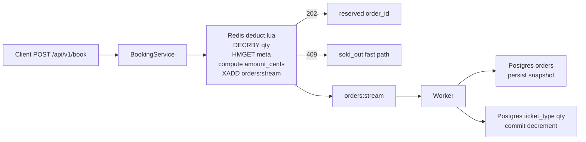
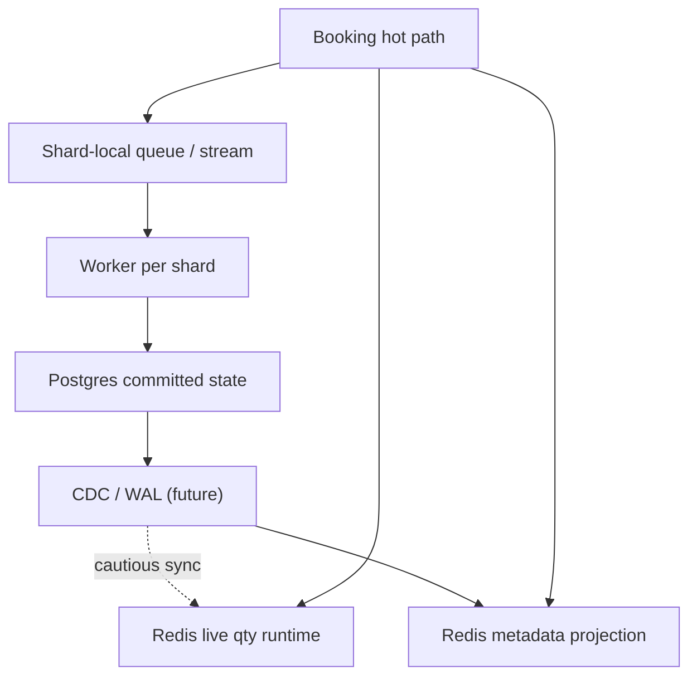

# Redis Runtime Metadata 與水平擴展筆記

> English version: [redis_runtime_metadata_scaling.md](redis_runtime_metadata_scaling.md)

## 狀態

這份筆記記錄的是 **PR #90 之後的 active follow-up design**。它整理了下一步準備把不可變的 ticket-type 快照搬進 Redis runtime metadata、再由 `deduct.lua` 直接消費的方向，以及團隊目前對下列議題的共識:

- 為什麼 `amount_cents` 要在訂票時凍結,而不是到 payment 才計算,
- Lua script 變長到什麼程度仍然合理,
- 什麼時候值得改用 Redis Functions,
- 以及目前真正阻礙水平擴展的是什麼。

在這個 follow-up merge 之前,請把它視為 booking hot path 的 canonical planning note,而不是 `main` 現況的陳述。

## 領域模型

- `event` = 演唱會 / 場次 / 活動本體。
- `ticket_type` = 使用者實際購買的可販售 SKU。
- 如果兩個選項有不同價格、不同庫存池、不同銷售窗口或不同購買規則,就應該建成不同的 `ticket_type`。
- 如果只是展示標籤,可以留在 `area_label`,不一定要變成獨立庫存池。

這個區分很重要,因為 booking hot path 是 ticket-type-centric: 使用者送的是 `ticket_type_id`,系統再從這個選擇推導出 `event_id` 與凍結的價格快照。

## 為什麼 `amount_cents` 要在訂票時凍結

`amount_cents` 不是單純的乘法結果,它是 reservation snapshot 的一部分。

booking 路徑在 reservation 時間點就凍結 `amount_cents` 與 `currency`,原因是:

1. 使用者應該支付建立 reservation 當下被 quote 的價格,
2. payment 階段應該 charge 一個已凍結的 order fact,而不是重新讀 mutable 的 ticket-type 狀態,
3. 非同步 worker 與後續 payment flow 應該接到一份完整的 reservation intent,
4. 結帳窗口中途若有人直接改價,不應悄悄把已保留的訂單重新定價。

換句話說:乘法之所以在 booking 階段發生,不是因為 Lua 比較方便算數,而是因為 **定價本來就是建立訂單的一部分**。

## 規劃中的 runtime-metadata 形狀

這個 follow-up 會用每個 ticket type 兩把 Redis runtime key,取代正常路徑上的 `TicketTypeRepository.GetByID` lookup:

- `ticket_type_meta:<ticket_type_id>` — 不可變的訂票快照欄位:
  - `event_id`
  - `price_cents`
  - `currency`
- `ticket_type_qty:<ticket_type_id>` — 可變的即時庫存計數器

規劃中的流程:

這個設計的操作規則:

- sold-out 請求應該在 Redis 內直接返回,不碰 Postgres,
- metadata miss 時必須先把 decrement revert 回去,再回 repair code,
- Go caller 最多做一次 cold-fill metadata + 一次 retry,
- rehydrate 要同時重建 metadata 與 qty runtime key,
- 直接在 DB 改 immutable ticket-type 欄位時,只能 invalidate metadata key,不能動到 qty key。

## 為什麼較長的 Lua script 仍然合理

對 Redis-side programmability 來說,真正重要的限制不是「幾行」,而是:

- script 是否維持固定成本,
- 是否避免掃描與無界迴圈,
- 是否只碰一小組已知的 key,
- 以及是否能夠足夠快地結束,不長時間霸佔 Redis main thread。

對這條 booking path 而言,可以接受的形狀是:

- 一次庫存扣減,
- 一次 metadata 讀取,
- 小量的字串 / 整數轉換,
- 一次 stream publish。

即使 source file 比早期的極簡 script 長,本質上仍然是小型的 server-side transaction。

真正不健康的情況會是:

- 在 hot path 裡 `SCAN` 或廣泛找 key,
- 迭代與使用者資料量成比例的集合,
- 在 booking script 內混進多模式 repair 邏輯,
- 或把應該屬於背景 reconciler 的工作塞進 Redis scripting。

## Lua scripts 與 Redis Functions

Lua scripts 和 Redis Functions 都是在 Redis 伺服器端執行,而且執行期間都會 block Redis event loop。Functions 並不是什麼「可以平行跑的 Lua」。

### 短版結論

- 如果目標是 **單一 Redis primary 上的 booking throughput**,比起 `EVALSHA` 或 `FCALL`,key topology 與 round trip 更重要。
- 如果目標是 **Redis 端 API 的長期維運與可讀性**,當 contract 穩定之後,Functions 會更吸引人。

### 取捨

| 面向 | Lua scripts(`SCRIPT LOAD` + `EVALSHA`) | Redis Functions(`FUNCTION LOAD` + `FCALL`) |
| :-- | :-- | :-- |
| 執行模型 | atomic、blocking | atomic、blocking |
| Raw performance | 好 | 對這種形狀通常差不多 |
| 部署模型 | app 擁有 script blob | 有名字的 Redis-side library |
| 命名 / 可發現性 | 以 SHA 為主,不太直觀 | function 有名字,較好觀察 |
| 重啟 / failover 後的生命週期 | script cache 需要留意 | 一級公民,生命週期較完整 |
| contract 還在變動時 | 通常比較簡單 | 儀式感較重 |
| contract 穩定後 | 可接受 | 維運上常更乾淨 |

目前建議:

- booking contract 還在演進時先維持 Lua,
- 等 runtime-metadata contract、補償語意、queue topology 都穩定後,再考慮把它搬到 Redis Functions。

## 水平擴展:真正重要的是什麼

真正要注意的是: **把 Lua script 換成 Redis Function,本身並不會讓設計自動變得 cluster-friendly**。

兩種模式都仍然受到 Redis multi-key 規則約束:

- 一次 server-side call 會碰到的每把 key,都必須顯式作為 key argument 傳入,
- 在 Redis Cluster 裡,同一次 multi-key atomic work 通常都得共置在同一個 hash slot。

所以真正的擴展問題是 **topology**,不是語法。

### 目前的阻礙

1. `qty` 與 `meta` key 還沒有用 Redis Cluster hash tags 來設計。
2. `deduct.lua` 還會在同一個 atomic call 內發佈到全域的 `orders:stream`。
3. 即使先把 metadata + qty co-slot,單一熱門 ticket type 仍可能形成單一 slot hotspot。

實務上,這代表目前的形狀仍然比較像「單一 primary 的 booking gate + 後方 async worker」。以現階段來說這是合理的,但它跟完全可分片的設計不是同一件事。

## Cluster-friendly 的方向

如果未來真的需要 Redis Cluster 或 app-level sharding,下一步不是爭論 Lua 還是 Function,而是重塑 key 與 queue。

未來比較有用的原則:

- 真正切到 Redis Cluster 之前,先把 key 命名改成 hash-tagged 版本,例如:
  - `ticket_type_meta:{<ticket_type_id>}`
  - `ticket_type_qty:{<ticket_type_id>}`
- 如果要真的分片,避免在同一個 atomic transaction 中依賴單一全域 stream,
- 比較偏好 shard-local queue / stream,讓庫存變更與 enqueue 都留在 shard 內,
- 不論 Lua 或 Functions,都要把熱門 ticket type 視為可能的 hot shard。

## CDC / WAL 備註

未來的 WAL / CDC sync,對 **immutable metadata** 比對 **live qty** 更自然。

- `ticket_type_meta` 很適合做 projection target。
- `ticket_type_qty` 比較困難,因為在 accepted reservation 尚未被 worker commit 進 Postgres 之前,Redis 可能暫時比 Postgres 更接近真實可售數。

如果很天真地做「DB 一變,就把 Redis qty 覆寫成 DB 值」,可能會把已經在 Redis 保留、但還沒落庫的庫存又加回去。

所以較安全的分階段方向是:

1. 先讓 metadata 走 CDC / WAL projection,
2. qty 先維持 hot runtime state + drift detection / reconciliation,
3. 之後再重新評估 qty 是否要拆成 committed state + pending-hold delta。

## 建議的 staged roadmap

1. **近期**
   - 維持 Lua,
   - booking gate 先留在單一 Redis primary,
   - 把 immutable booking metadata 搬進 Redis runtime key,
   - 保留 reservation 當下凍結價格快照的做法。
2. **contract 穩定後**
   - 再考慮把 `deduct` / `revert` 升級為 Redis Functions,換更好的 operational lifecycle。
3. **真正做 Redis 分片前**
   - 先導入 hash-tagged key 命名,
   - 重新設計 queue topology,不要讓 atomic path 依賴全域 stream。
4. **更後面**
   - 用 CDC / WAL 管 metadata projection,
   - 再評估 qty 要不要維持 runtime-only,還是拆成 committed + pending delta。

## 決策摘要

- 如果眼前問題是 **booking hot-path performance**,先優化 runtime key 形狀與減少 round trip。
- 如果眼前問題是 **Redis-side operability**,Functions 是較乾淨的長期介面。
- 如果眼前問題是 **真正的水平擴展**,先重設 key 與 queue topology,再討論 Lua 或 Functions。
